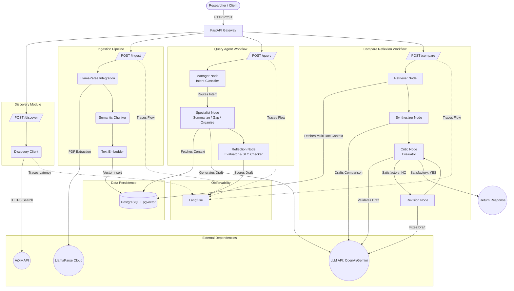

# System Architecture & Multi-Agent Design

The AI Research Lab Partner acts as an orchestration layer connecting LLMs, vector databases, document parsers, and external scholarly APIs through highly specialized LangGraph workflows. 

Below is the complete architectural diagram representing the entire system!

## Architecture Diagram (Mermaid)

### Key Highlights
- **Discovery**: A fast, stateless proxy to ArXiv via secure HTTPS.
- **Ingestion**: A linear data pipeline. LlamaParse handles complex multi-modal layout logic (tables/equations) before text chunking and vector storage.
- **Query (LangGraph)**: A 3-step sequential graph. The **Manager** dynamically routes the user to a specialized persona, the **Specialist** creates a grounded draft, and the **Reflector** acts as an AI judge to score the output against strict SLOs.
- **Compare (LangGraph Reflexion)**: A cyclic evaluation graph. The **Critic** operates in a `while` loop (up to `MAX_ITERATIONS`), forcefully returning the draft to the **Revisor** if it fails structural or accuracy checks.
- **Observability**: Every single node, network call, and LLM query acts as a span bubbling up to **Langfuse** for strict performance metrics.
